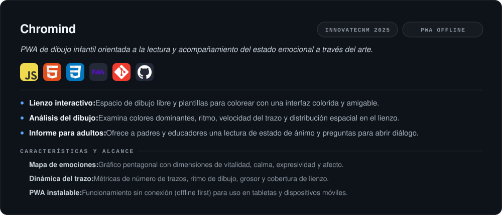
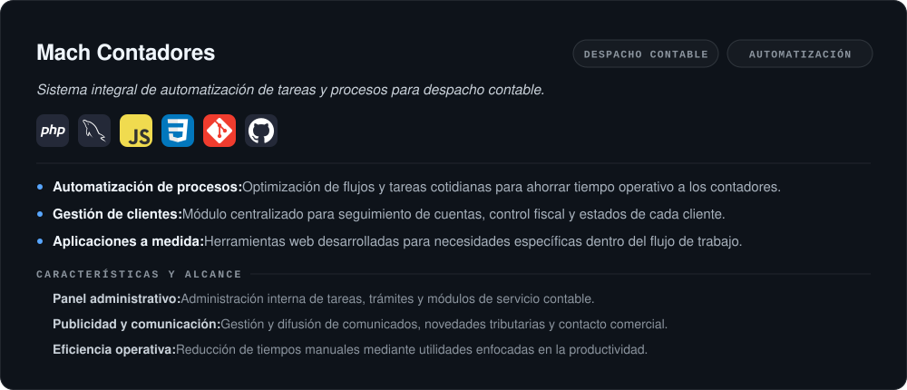

<!--═══════════════════════════════════════════════════════════════════════════
  PERFIL DE GITHUB · Jesús Francisco Gutiérrez Villa
  ──────────────────────────────────────────────────────────────────────────
  Todo el layout vive en SVG (carpeta /assets) porque GitHub elimina CSS y
  aplica `table { display:block; width:max-content }` a las tablas, lo que
  impide cualquier control real de anchos y simetría.

  Retícula:  lienzo 1000 px · margen 40 · columnas exactas de 1/3 y 1/4.
  Temas:     cada bloque tiene versión -dark y -light; <picture> elige sola.
  Editar:    modifica assets/_generador.py y ejecuta `python3 _generador.py`.
═══════════════════════════════════════════════════════════════════════════-->

<picture>
  <source media="(prefers-color-scheme: light)" srcset="https://raw.githubusercontent.com/JesusVillaDev/JesusVillaDev/HEAD/assets/header-light.svg">
  
</picture>

<h2 align="center" id="perfil">Perfil</h2>

<picture>
  <source media="(prefers-color-scheme: light)" srcset="https://raw.githubusercontent.com/JesusVillaDev/JesusVillaDev/HEAD/assets/perfil-light.svg">
  
</picture>

<h2 align="center" id="stack">Stack Tecnológico</h2>

<picture>
  <source media="(prefers-color-scheme: light)" srcset="https://raw.githubusercontent.com/JesusVillaDev/JesusVillaDev/HEAD/assets/stack-light.svg">
  
</picture>

<h2 align="center" id="proyectos">Proyectos Destacados</h2>

<picture>
  <source media="(prefers-color-scheme: light)" srcset="https://raw.githubusercontent.com/JesusVillaDev/JesusVillaDev/HEAD/assets/proyecto-01-light.svg">
  
</picture>

 

<picture>
  <source media="(prefers-color-scheme: light)" srcset="https://raw.githubusercontent.com/JesusVillaDev/JesusVillaDev/HEAD/assets/proyecto-02-light.svg">
  
</picture>

 

<picture>
  <source media="(prefers-color-scheme: light)" srcset="https://raw.githubusercontent.com/JesusVillaDev/JesusVillaDev/HEAD/assets/proyecto-03-light.svg">
  
</picture>

 

<picture>
  <source media="(prefers-color-scheme: light)" srcset="https://raw.githubusercontent.com/JesusVillaDev/JesusVillaDev/HEAD/assets/proyecto-04-light.svg">
  
</picture>

<h2 align="center" id="trayectoria">Trayectoria e Intereses</h2>

<picture>
  <source media="(prefers-color-scheme: light)" srcset="https://raw.githubusercontent.com/JesusVillaDev/JesusVillaDev/HEAD/assets/trayectoria-light.svg">
  
</picture>

 

<picture>
  <source media="(prefers-color-scheme: light)" srcset="https://raw.githubusercontent.com/JesusVillaDev/JesusVillaDev/HEAD/assets/intereses-light.svg">
  
</picture>

<h2 align="center" id="estadisticas">Estadísticas de GitHub</h2>

<picture>
  <source media="(prefers-color-scheme: light)" srcset="https://github-activity-graph.vercel.app/graph?username=JesusVillaDev&amp;bg_color=FFFFFF&amp;color=0969DA&amp;line=0969DA&amp;point=1F2328&amp;area=true&amp;area_color=0969DA&amp;hide_border=true&amp;radius=14">
  
</picture>

  

<picture>
  <source media="(prefers-color-scheme: light)" srcset="https://github-profile-summary-cards.vercel.app/api/cards/profile-details?username=JesusVillaDev&amp;theme=default">
  
</picture>

<h2 align="center" id="contacto">Contacto</h2>

  Disponible para oportunidades laborales, prácticas profesionales y colaboración técnica.

  <a href="mailto:jesusfgv.dev@gmail.com"><picture><source media="(prefers-color-scheme: light)" srcset="https://raw.githubusercontent.com/JesusVillaDev/JesusVillaDev/HEAD/assets/btn-correo-light.svg"></picture></a>
  <a href="https://linkedin.com/in/jesusfgv"><picture><source media="(prefers-color-scheme: light)" srcset="https://raw.githubusercontent.com/JesusVillaDev/JesusVillaDev/HEAD/assets/btn-linkedin-light.svg"></picture></a>
  <a href="https://github.com/JesusVillaDev"><picture><source media="(prefers-color-scheme: light)" srcset="https://raw.githubusercontent.com/JesusVillaDev/JesusVillaDev/HEAD/assets/btn-github-light.svg"></picture></a>

<!-- PENDIENTE ▸ Botón de CV. Añade el archivo del CV al repo y descomenta:
   -->

<picture>
  <source media="(prefers-color-scheme: light)" srcset="https://raw.githubusercontent.com/JesusVillaDev/JesusVillaDev/HEAD/assets/footer-light.svg">
  
</picture>

