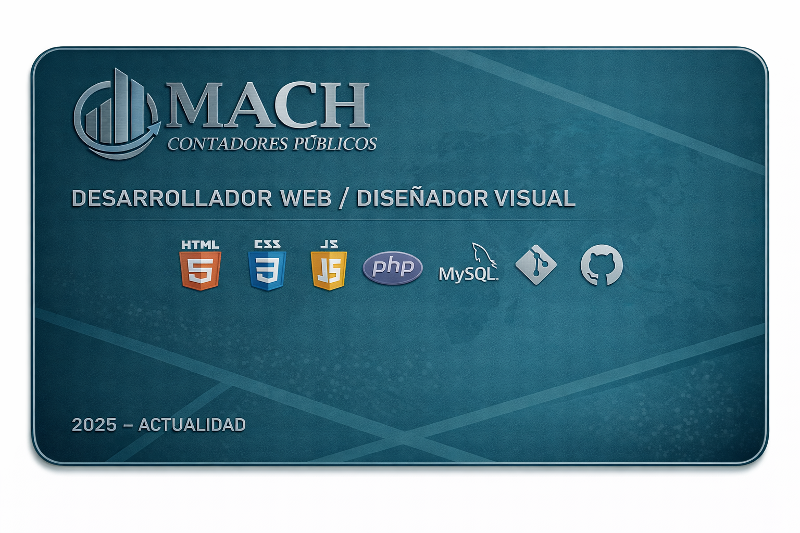

---

## PERFIL

Estudiante de Ingeniería Informática con enfoque en desarrollo de software y sistemas web. He trabajado en proyectos reales y académicos que abarcan diseño visual, desarrollo full stack y modelado de bases de datos. Me caracterizo por una formación técnica sólida, pensamiento estructurado y constante interés por mejorar mis habilidades en entornos reales de desarrollo.

---

## SKILLS TÉCNICAS

| Tecnología | Nivel |
|---------|-------|
| HTML / CSS | ███████░░░ 75% |
| PHP | ███████░░░ 75% |
| Java | ████████░░░ 80% |
| Python | ██████░░░░ 60% |
| Git / GitHub | ███████░░░ 70% |
| Agile / Scrum | ████░░░░░░ 40% |

---

## EXPERIENCIA

### MACH – Despacho Contable  
**Desarrollador Web / Diseñador Visual**  

🔗 https://machcontadorespublicos.com/

Desarrollo completo del sitio web desde cero, abarcando frontend, backend y base de datos. Implementación de herramientas internas para la gestión del despacho, así como el rediseño de identidad visual incluyendo logotipo, iconografía, tarjetas de presentación y paleta de colores. Participación activa tanto en decisiones técnicas como visuales del proyecto.

---

## FORMACIÓN COMPLEMENTARIA

- Certificación en Inteligencia Artificial  
- Curso de Contabilidad  
- Taller presencial de Machine Learning – Wizeline  
- Formación continua en desarrollo web y programación

---

## IDIOMAS

| Idioma | Nivel |
|------|-------|
| Español | ██████████ 100% |
| Inglés | ████░░░░░░ 40% |
